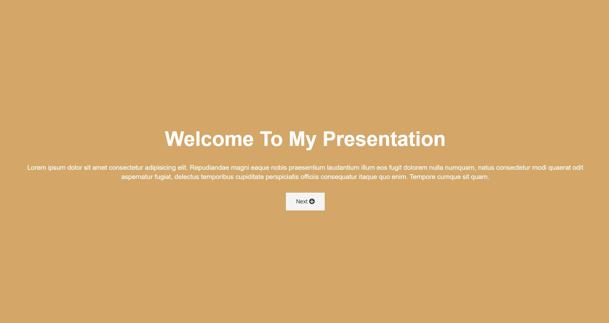
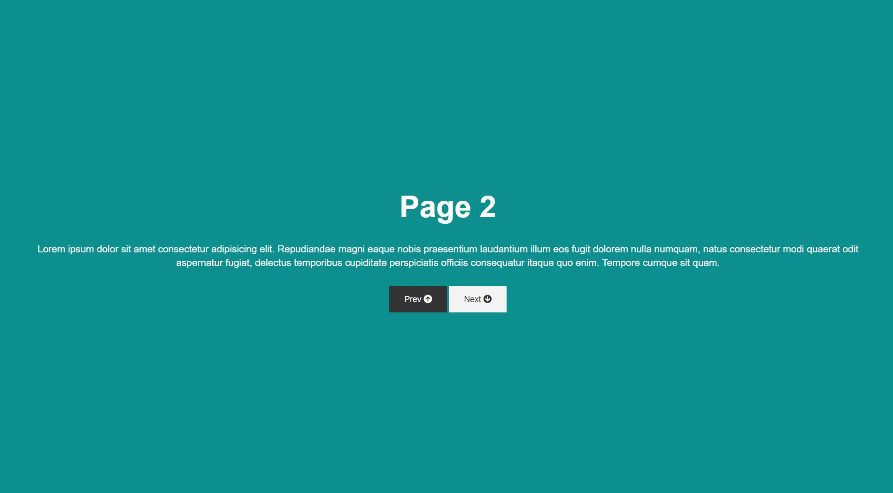

# Presentation-Website
### Presentation Website created using HTML, CSS with basic animations (keyframes, transitions).

## Screenshots

## Tools used while developing this project
- Visual Studio Code
- HTML
- CSS
- Gitbash

## Acknowledgements
- [fontawesome](https://fontawesome.com/)

## Contacts 
- E-mail address orkhan.elchuev@gmail.com

